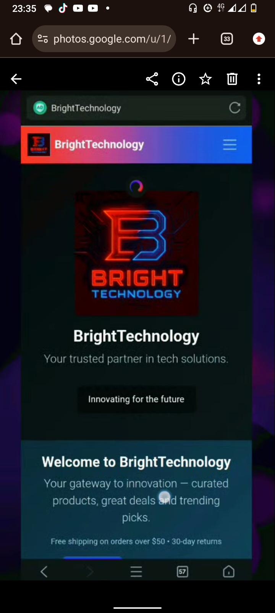
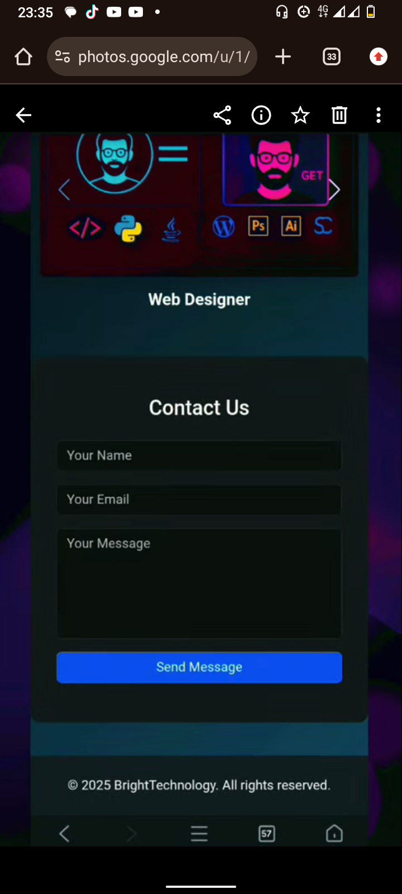

# Bright Technology Web Platform

A full-stack web application developed to demonstrate modern web development practices including frontend and backend integration.

## Technologies Used
- HTML
- CSS
- JavaScript
- PHP
- MySQL
- React
- Node.js

## Features
- Responsive web design
- Database integration
- Backend API functionality
- User-friendly interface

## Project Goals
This project demonstrates my ability to design and build full-stack web applications using modern development frameworks.

## Screenshots

## Author
Ephraim Wakhata

GitHub: https://github.com/Wakhataephraim09
LinkedIn: https://ke.linkedin.com/in/ephraim-wakhata-61b2b52b1
